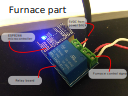

# Wireless Thermostat
**Authors** 
*Saif Abid, Jiri Kuba*

## Desription
(click to enlarge)

  

## HW setup ESP-01s
ESP-01s is using ESP8266 microcontroller. [There](./docs/Esp-01s_datasheet_chinese.pdf) is chinese datasheet with schematics.

  

### ESP8266 Programing mode
To flash ESP-01s - pull GPIO0 to GND, pull RST to GND and release RST.

## Build setup
Install [ArduinoIDE](https://www.arduino.cc/en/Main/Software) and add ESP8266 support as described [here](https://github.com/esp8266/Arduinor).

Import project to ArduinoIDE, build and flash as usuall Arduino project.

### Faster builds without ArduinoIDE
Clone [makeEspArduino](https://github.com/plerup/makeEspArduino) to $HOME directory.
 
Command for build and flash:

``` make -f ~/makeEspArduino/makeEspArduino.mk UPLOAD_SPEED=921600 flash ```
